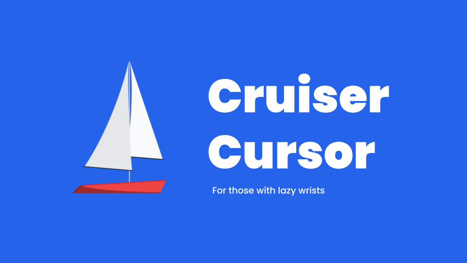
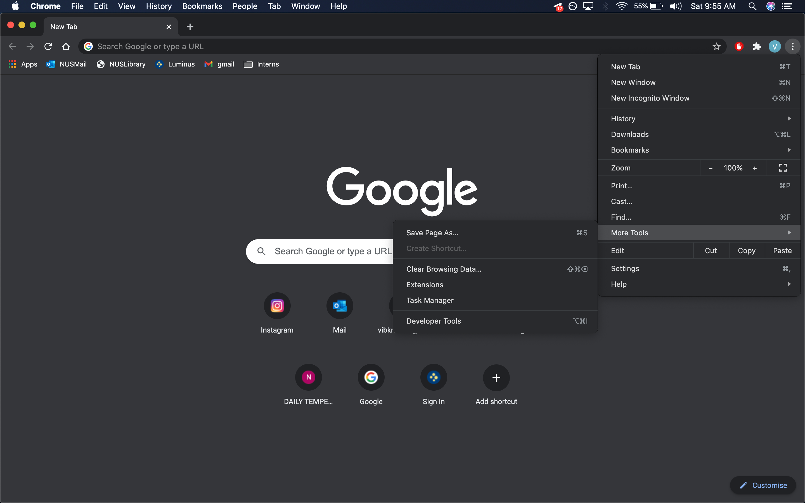
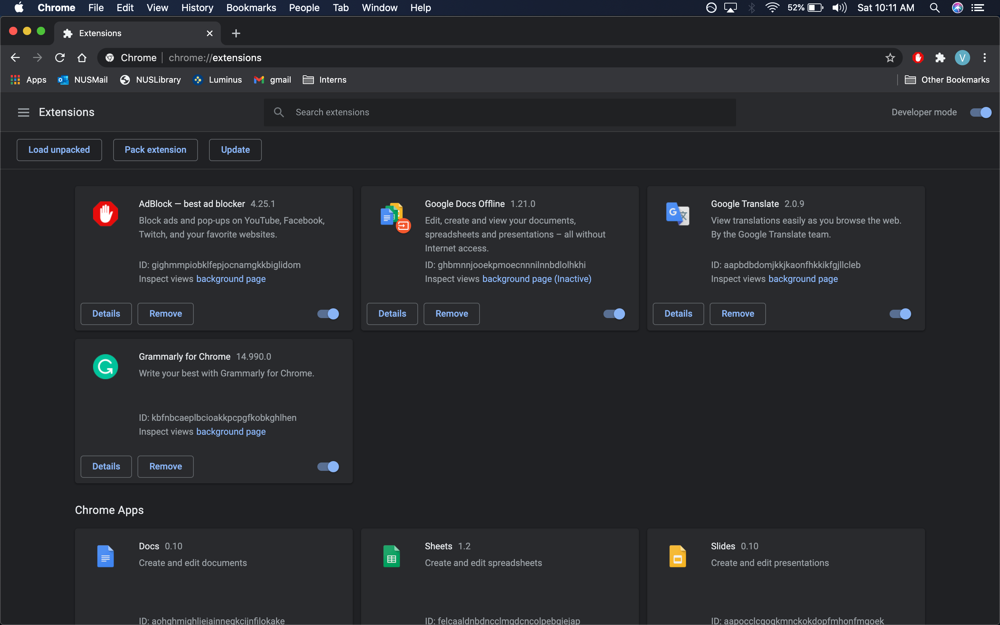
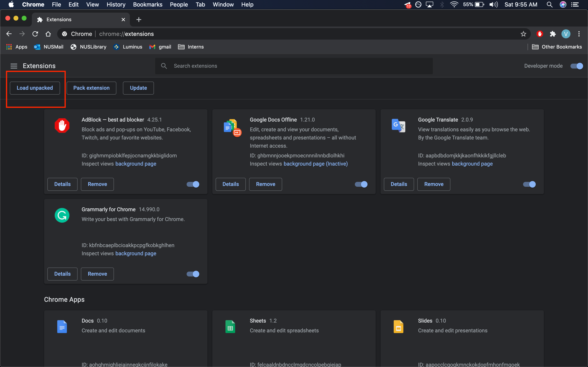
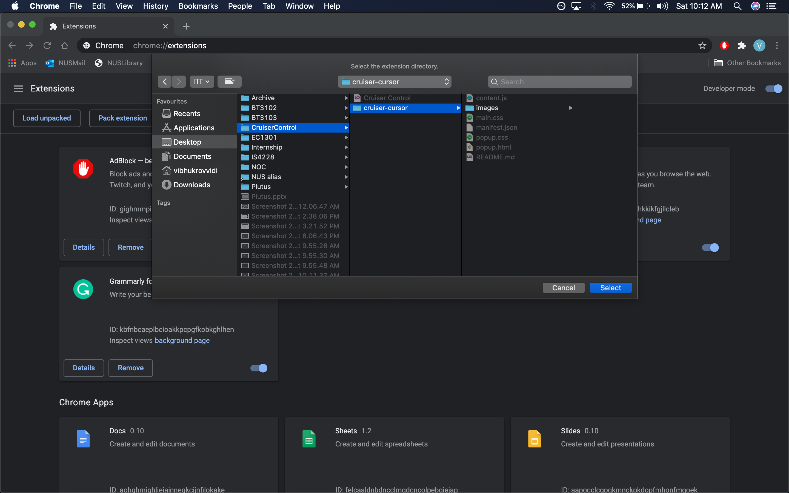
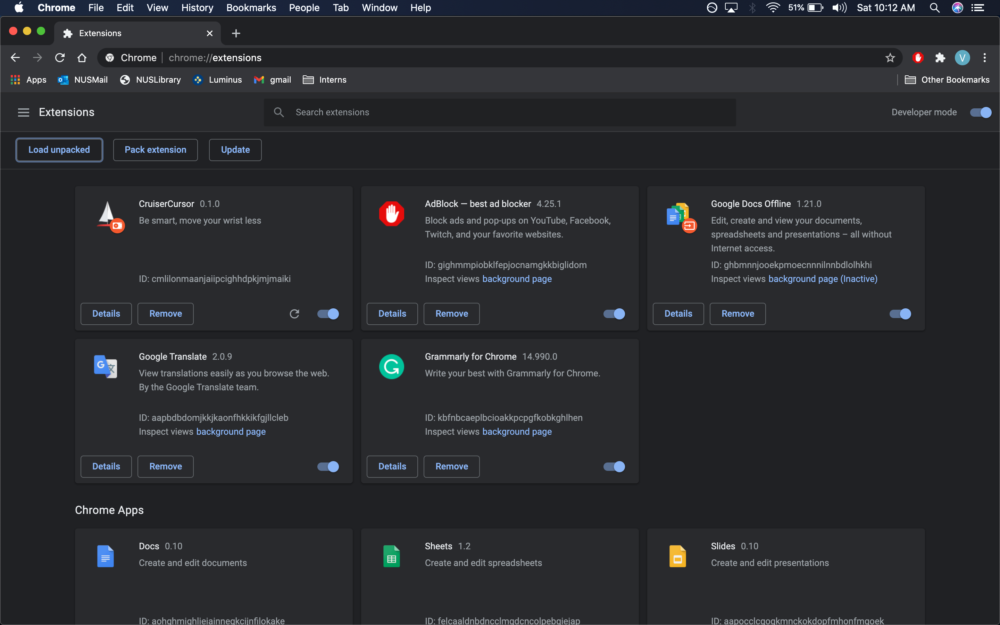

- [Cruiser Cursor](#cruiser-cursor)
  - [For Those With Lazy Wrists](#for-those-with-lazy-wrists)
    - [About Cruiser Cursor](#about-cruiser-cursor)
    - [Installation](#installation)
    - [How It Works](#how-it-works)
    - [The Team](#the-team)
  
# Cruiser Cursor

## For Those With Lazy Wrists

------

### About Cruiser Cursor

Cruiser Cursor is a chrome extension that makes browsing the internet easier and more efficient. The user's cursor is tracked and the extension identifies relevant clickable objects on the webpage in the path of the cursor's trajectory in order to predict the user's next click. Cruiser Cursor is a productivity and accessibility tool which enables faster browsing and reduces muscle strain, especially when spending long hours surfing the web.

------

### Installation

Want to try it out? Let's get started!

**Step 1:** On Chrome, go to the menu bar

Click on More Tools

**Step 2:** On the extensions page, make sure you have **Developer Mode** turned on.

**Step 3:** Click on Load Unpacked and when prompted, select the folder which houses this GitHub repository on your computer.

**Step 4:** Enable the Extension from the extension menu page. You're good to go now! Enjoy surfing the web on Cruiser Cursor!

------

### How It Works

Once activated, the extension takes snapshots of the user's cursor at fixed intervals. Using this, over a small window, a vector is created for the direction of the cursor movement. The script goes through the website identifying all possible clickable objects such as buttons, images or links. Using information from the direction, the algorithm finds the most relevant clickable object within a fixed field of view from the cursor and animates that object. If the user likes the prediction, they can simply click at their current cursor position, taking them to the next page and expediting the browsing process!

------

### The Team

Dominique Ng

Raivat Shah

Siddhant Bansal

Vibhu Krovvidi

------

Made for Hack&Roll 2021

